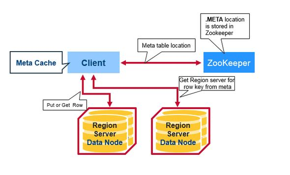
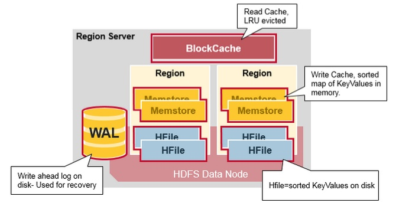

### HBASE架构分析

hbase在架构上有三种服务组件组成：Zookeeper，Master Server，Region Server

- Zookeeper。Zookeeper的主要作用是监测集群中节点的状态，保证集群的高可用性。

- Master Server。进程名称hmaster，一个**元数据**管理服务器，管理数据的元信息，如列族的定义，数据的位置，在那个Region Server上等。
- Region Server。 负责实际数据的读写，当有数据请求时，客户端与hbase的Region Server直接通信。

>> 元数据这个词语在数据库或大数据相关的技术中会经常遇见。如hdfs中的namenode,hive中的metaserver等。
#### Region Server

HBase的数据存储是基于HDFS的，RegionServer负责存取hdfs数据。如果一台服务器既是RegionServer节点又是HDFS的DataNode节点，那么RegionServer会把数据的一个副本存储在本地HDFS中，加快访问速度。
如果一个RegionServer迁移到一个新的DataNode节点，这个RegionServer在这个节点的HDFS上没有本地副本，当HBase运行compaction时会把一个副本迁移到本地。

HBase的表按照Row Key的值划分到不同的region，RegionServer负责管理region，一个RegionServer可以管理一个或多个region，最多可以管理1000个region。

#### Master Server
HBase Master主要负责分配region和管理数据的元信息。
主要功能：
- 协调RegionServer
- 在集群处于数据恢复或者动态调整负载时，分配region到某一个RegionServer中
- 管控集群，监控所有RegionServer的状态
- 提供DDL相关的API，创建、删除、更新表结构。

#### ZooKeeper
ZooKeeper是一个分布式的无中心的元数据存储服务。ZooKeeper监测HBase集群中节点的状态信息，如果监测到某个节点宕机，Zookeeper会通知HBase Master Server节点。在生产环境ZooKeeper至少需要部署3个节点，用来满足Paxos选举算法的最低要求。

RegionServer节点和MasterServer节点通过heartbeat方式向ZooKeeper报告状态

Zookeeper、MasterServer、RegionServer三者协同工作。
ZooKeeper负责维护集群的成员列表，监测哪台服务器在线，哪台服务器宕机。RegionServer和主备MasterServer与ZooKeeper维护一个session连接，通过这个session定时发送hearbeat，通知ZooKeeper说明自己在线。

ZooKeeper有一个Ephemeral Node(临时节点)的概念，session连接在ZooKeeper中建立一个临时节点(Ephemeral Node)，如果这个session断开，临时节点被自动删除。

所有的RegionServer都与ZooKeeper保持一个session连接并建立Ephemeral Node，MasterServer通过监控这些临时节点，可以发现新加入的RegionServer，也可以监控到RegionServer是否宕机。
为了保证高可用，MasterServer也有两个或多个，这些MasterServer也同时向ZooKeeper注册Ephemeral Node，ZooKeeper把第一个成功注册的MasterServer节点设置成active状态，其它MasterServer节点处于inactive状态。

在规定时间内，ZooKeeper没有收到处于active状态MasterServer节点的heartbeat，连接session超时，对应的临时节点自动删除，处于inactive状态的MasterServer节点得到通知，立即切换为active状态提供服务。

同样，如果ZooKeeper没有及时收到RegionServer的heartbeat，session过期，临时节点删除，MasterServer得知RegionServer宕机，启动数据恢复。
#### HBase的读写流程
HBase把各个Region的位置信息存储在一个特殊的表中，这个表叫做meta table，ZooKeeper里面存储了这个meta table的位置信息。

**HBase的访问流程**
1. 客户端访问ZooKeeper，获取meta table的位置信息
2. 客户端读取meta table，从meta table里面得到row key所对应的RegionServer
3. 访问RegionServer，访问数据。

客户端缓存meta table的位置和row key的位置信息，避免访问ZooKeeper和meta table的开销。由于RegionServer宕机等原因会导致region被迁移到其它RegionServer节点，HBase客户端的缓存失效，重新访问ZooKeeper和meta table更新缓存。

#### HBase Meta Table
meta table使用类似b-tree的方式存储所有region的列表。
meta table的结构如下：
- key：region的起始row key，region id
- values: RegionServer

#### Region Server结构
RegionServer运行在HDFS的data node上，有4个部分组成：
- WAL。Write Ahead Log，预写日志文件，存储在HDFS上。RegionServer崩溃后，日志文件用来恢复新写入、但是还没有刷新到硬盘上的数据。
- BlockCache。查询缓存，在内存里缓存频繁读取的数据，如果BlockCache满了，会根据LRU算法清除最近不活跃的数据，释放缓存空间。
- MemStore。写入缓存，HBase中数据在被刷新到磁盘之前是缓存在内存中的MEMStore的，每个region的每个列族都有一个MemStore，MemStore的数据先根据key排序，然后写入硬盘。
- HFile。HDFS上的数据文件，里面存储key value对。

##### HBase写入流程
当HBase客户端发起put请求，第一步是将数据写入预写日志(WAL):
- 将数据操作记录写到WAL的末尾
- RegionServer崩溃时，可以使用WAL恢复MemStore中的数据
- 数据写入WAL并存储在MemStore之后，向用户返回写成功。
  
  
##### MemStore
MemStore在内存中按照key的顺序存储Key-Value对，一个MemStore对应一个列族(Column Family)，HFile里面所有的Key-Value对也是根据Key有序存储。

#### 参考资料
- [深入分析hbase架构](https://zhuanlan.zhihu.com/p/30414252)
- [An In-Depth Look at the HBase Architecture](https://mapr.com/blog/in-depth-look-hbase-architecture/#.VdMxvWSqqko)
